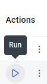

# Bachelor thesis
This is the repository for my bachelor thesis

“Evaluation of drought definitions in scientific publications using automated information retrieval:  An examination of the methodology and accuracy of scientific publications in forested areas on drought”

All my code for the automatic information extraction, as well as the re-analysis of the drought definitions will be uploaded and managed here.

<!-- TABLE OF CONTENTS -->
  
Table of Contents

  <ol>
    <li>
      <a href="#about-the-project">About The Project</a>
    </li>
    <li>
      <a href="#getting-started">Getting Started</a>
      <ul>
        <li><a href="#prerequisites">Prerequisites</a></li>
        <li><a href="#installation">Installation</a></li>
        <li><a href="#results">Results</a></li>
      </ul>
    </li>
    <li><a href="#links">Links</a></li>
    <li><a href="#license">License</a></li>
    <li><a href="#contact">Contact</a></li>
  </ol>

## About The Project

Einführung ins Thema und was das Programm macht und wofür es gedacht ist
This Python program is part of my Bachelorthesis. 

(<a href="#readme-top">back to top</a>)

## Getting Started

The here published program is published to Docker, to allow all users to access and run it  
and offers the possibility for reproducible working and testing, since example data is added for users to   
run the program without having to provide their own data.

### Prerequisites

To execute the program, Docker Desktop is needed.

[Installation manual for Windows](https://docs.docker.com/desktop/setup/install/windows-install/)
[Installation manual for Mac](https://docs.docker.com/desktop/setup/install/mac-install/)
  
### Usage

When Docker Desktop is installed and set up, the following steps can be taken to run the program:

1. Open the internal terminal of Docker Desktop on the bottom right:

2. Pull the Docker image from Dockerhub: 
    2.1. For Windows (amd64) operating system: $
    2.2. For Mac (arm64) operating system: $

3. Start the Image using Docker Desktop:  

$ docker compose up  

or press the 'run' bottom next to the pulled image in the 'Images' section  

(<a href="#readme-top">back to top</a>)

### Results

The output of the program is an updated Excel Open XML Spreadsheet (XLSX) file.  
This file can be downloaded from the, by the Image and its Container created, Volume in the 'Volumes' section. 

(<a href="#readme-top">back to top</a>)

<!-- LICENSE -->
## License

Distributed under the MIT License. See [LICENSE](https://github.com/JonthMM/Bachelor-thesis/blob/main/LICENSE) for more information.

(<a href="#readme-top">back to top</a>)

<!-- CONTACT -->
## Contact

Jonathan Wisser - jmader@uni-muenster.de

Project Link: [https://github.com/JonthMM/Bachelor-thesis](https://github.com/JonthMM/Bachelor-thesis)

(<a href="#readme-top">back to top</a>)

<!-- LINKS -->
## Links

More data available here, including the shapefile and their attribute tables as XSLX files, the manually verified XSLX file.  
https://uni-muenster.sciebo.de/s/Gy1fD6fWTfTYStg

This readme template is based on the BLANK_README.md example of the following project:  
https://github.com/othneildrew/Best-README-Template/tree/main

(<a href="#readme-top">back to top</a>)
